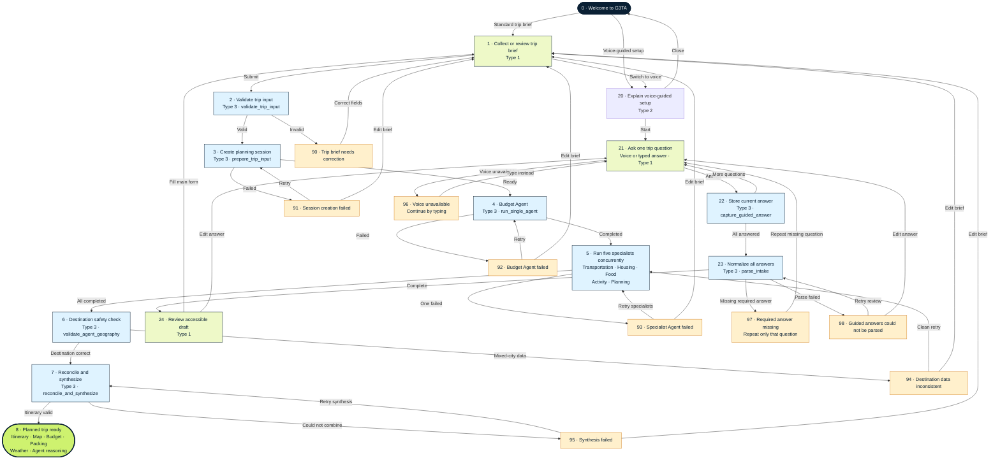

# G3TA Trip Planner State Chart

This chart documents the current trip-planning experience. It uses the same
node convention as the reference JSON:

- Type `1`: interactive instruction or user decision
- Type `2`: message, recovery, or result
- Type `3`: function/action

The chart ends when the planned trip is ready. Booking is a separate workflow
and is intentionally not included.

## Main success path

`Trip brief → validation → planning session → Budget Agent → five parallel
specialists → destination check → reconciliation and synthesis → planned trip`

## Source files

- Machine-readable chart: [`trip_planner_statechart.json`](../trip_planner_statechart.json)
- Validated state-machine reader: [`backend/state_machine.py`](../backend/state_machine.py)
- Contract tests: [`backend/tests/test_state_machine.py`](../backend/tests/test_state_machine.py)
